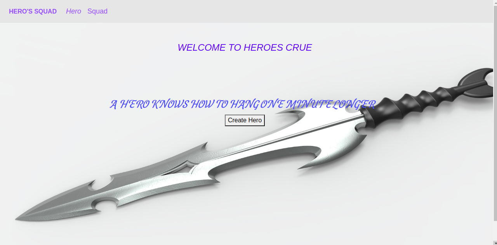

# HERO-SQUADE PROJECT
## Author Name:UWITONZE BRENDAH
### DESCRIPTION
This is application allows users to  recruit a well-balanced team of superheroes .you can create a squad and then choose or recruit a hero of your choose depending on what you like on him .
 #### SETUP INTRUCTIONS
* Java - The language used
* Intellij Idea - Intergated development
* Spark - Framework

Link to the project
[herosquad](https://github.com/brendahuwitonze/HEROSQUADE)

## LINCES

MIT License

Copyright (c) 2019 UWITONZE BRENDAH

Permission is hereby granted, free of charge, to any person obtaining a copy of this software and associated documentation files (the "Software"), to deal in the Software without restriction, including without limitation the rights to use, copy, modify, merge, publish, distribute, sublicense, and/or sell copies of the Software, and to permit persons to whom the Software is furnished to do so, subject to the following conditions:

The above copyright notice and this permission notice shall be included in all copies or substantial portions of the Software.

